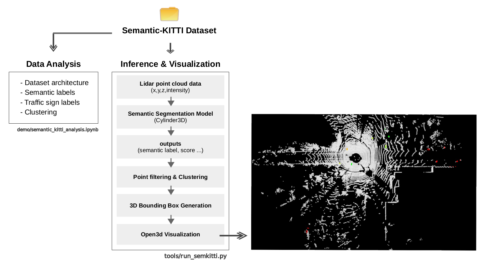
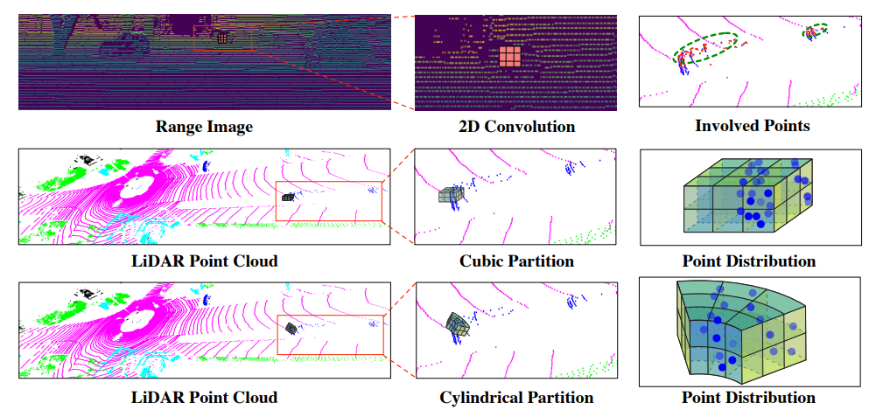
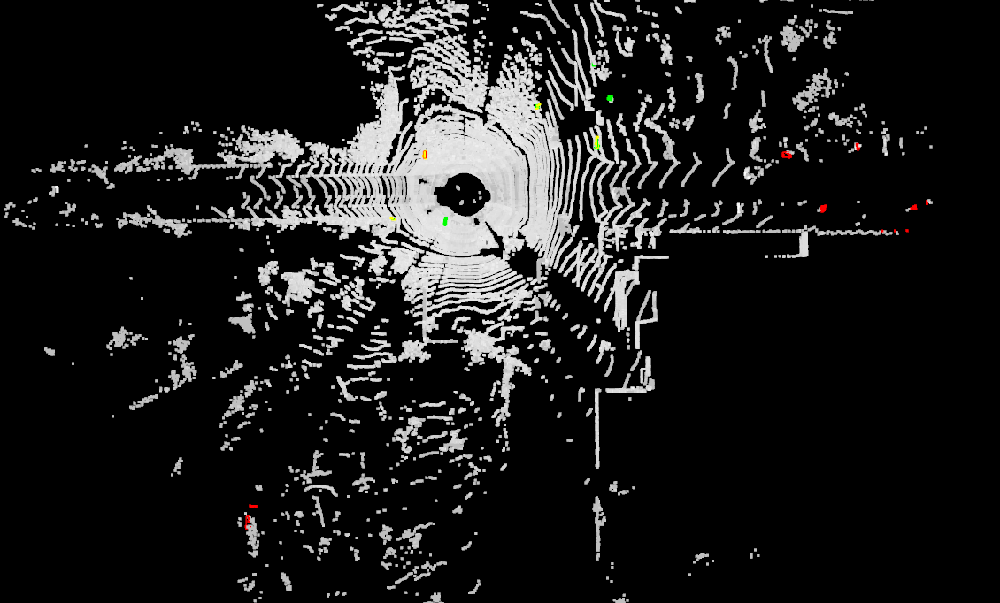
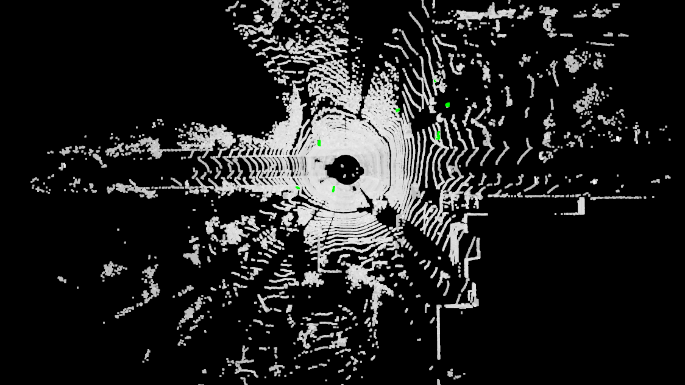
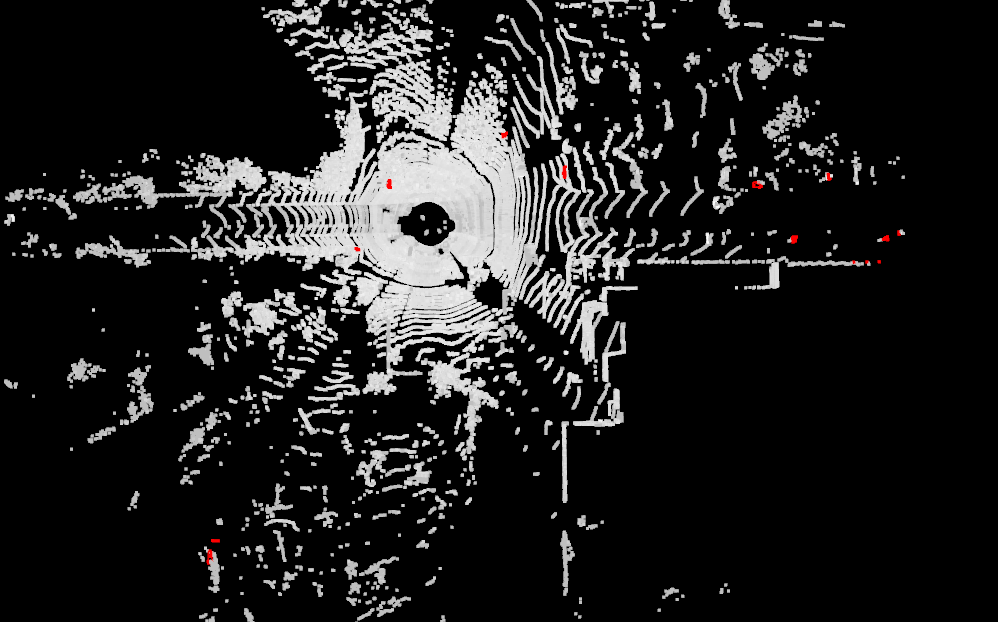
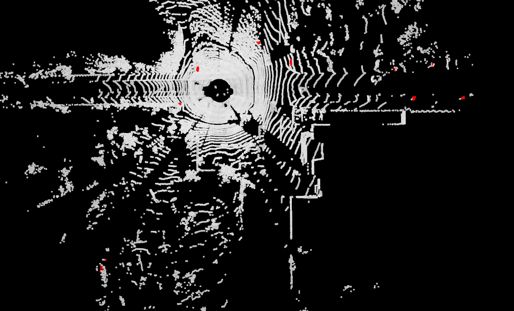
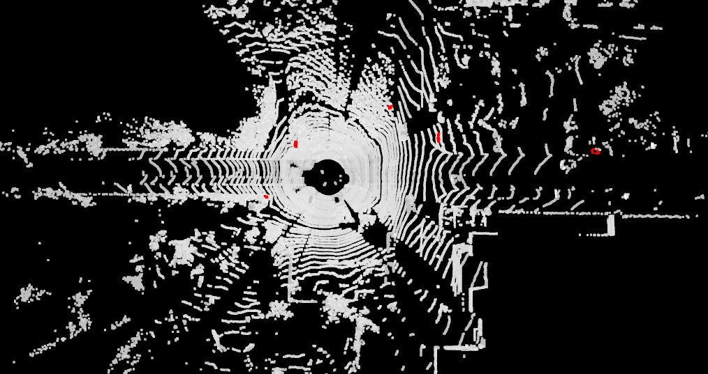
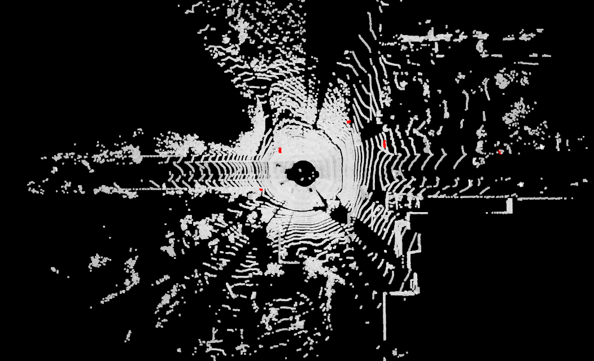

# LiDAR Object Detection : Traffic Sign using SemanticKITTI

## Overview

SemanticKITTI 데이터셋과 Pretrained Semantic Segmentation 모델(Cylinder3D)을 활용하여 **Traffic Sign 객체를 추출하고 3D Bounding Box를 생성하는 파이프라인**을 구현하였다.

- Pretrained model을 통해 Semantic Segmentation 모델 추론을 수행하고 Traffic Sign 클래스에 해당하는 포인트를 추출
- 클러스터링을 통해 개별 객체를 분리하고 Bounding Box를 생성
- Confidence-based Filtering 및 Distance-based Filtering을 적용하여 오탐(False Positive) 제거
- GT / Prediction 비교 시각화를 통해 결과 분석


## Architecture Diagram

<p align="center">
  
</p>


# Project Structure

```text
.
├── demo
│   └── semantic_kitti_analysis.ipynb
│
├── tools
│   └── run_semkitti.py
│
├── data
│   └── semantickitti
│
├── checkpoints
│   └── model.pth
│
└── README.md
```


# Environment

## System

| Item | Version |
|------|---------|
| GPU | NVIDIA GeForce RTX 3080 Ti (12GB) |
| CUDA | 12.1 |
| Python | 3.10+ |

## Dependencies

| Package | Version |
|---------|---------|
| PyTorch | 2.1.2+cu121 |
| TorchVision | 0.16.2+cu121 |
| MMEngine | 0.10.7 |
| MMCV | 2.1.0 |
| MMDetection | 3.3.0 |
| MMDetection3D | 1.4.0 |
| Open3D | 0.19.0 |
| NumPy | 1.26.4 |
| Scikit-learn | 1.7.2 |

# Setup

#### 1. Dataset

본 프로젝트는 **SemanticKITTI Dataset**을 사용한다.


다운로드 후 다음과 같은 구조로 배치한다.

```text
data/
└── semantickitti/
    └── sequences/
        ├── 00
        ├── 01
        ├── ...
        └── 21
```


#### 2. Pretrained Model

Semantic Segmentation 모델은 MMDetection3D에서 제공하는 [Cylinder3D Pretrained Checkpoint](https://download.openmmlab.com/mmdetection3d/v1.1.0_models/cylinder3d/cylinder3d_4xb4_3x_semantickitti/cylinder3d_4xb4_3x_semantickitti_20230318_191107-822a8c31.pth)를 사용하였다.

Checkpoint는 다음 위치에 저장한다.

```text
checkpoints/
└── model.pth
```

Config 파일은 다음 위치를 사용한다.

```text
configs/
└── cylinder3d/
    └── cylinder3d_4xb4-3x_semantickitti.py
```


# 1. SemanticKITTI Dataset Analysis

SemanticKITTI는 KITTI Odometry 데이터셋에 Point-wise Semantic Label이 추가된 LiDAR Semantic Segmentation 데이터셋이다.

각 시퀀스는 다음과 같은 구조로 구성된다.

```text
sequences/
 ├── 08
 │   ├── velodyne
 │   ├── labels
 │   ├── calib.txt
 │   └── poses.txt
```

데이터 분석 내용은 Jupyter Notebook(🔗[SemanticKITTI Dataset Analysis](demo/semantic_kitti_analysis.ipynb))에 정리하였다.

* demo/semantic_kitti_analysis.ipynb


분석 항목

* Point Cloud 구조 확인
* Semantic Label 구조 분석
* 클래스 분포 확인
* Traffic Sign 클래스 분석
* Point Cloud 시각화
* 클러스터링 비교 분석


# 2. Semantic Segmentation Inference

## Model Selection

본 과제에서는 MMDetection3D에서 제공하는 SemanticKITTI용 Pretrained 모델인 **Cylinder3D**를 사용하였다.

직접 모델을 재학습하기보다 Pretrained Weight를 활용하여 Traffic Sign 검출 파이프라인 구현에 집중하였다.

Cylinder3D를 선택한 이유는 다음과 같다.

* MMDetection3D 공식 지원
* SemanticKITTI용 Pretrained Weight 제공
* 원통 좌표계(Cylindrical Coordinate System) 기반 Point Cloud 표현
* SemanticKITTI Benchmark에서 검증된 성능


## Model Overview

Cylinder3D는 Point Cloud를 원통 좌표계로 변환한 후 Sparse 3D Convolution을 수행하는 Semantic Segmentation 모델이다.

<p align="center">
  
</p>

### Input

```text
N x 4
(x, y, z, intensity)
```

### Output

```text
N x 1
semantic label
```

각 포인트에 대해 Semantic Class를 예측하며, 본 프로젝트에서는 Traffic Sign 클래스만 활용하여 후처리를 수행하였다.


# 3. Traffic Sign 3D Bounding Box Generation

Semantic Segmentation 결과로부터 Traffic Sign 객체를 추출하고 Bounding Box를 생성하였다.

## 3.1 Traffic Sign Point Extraction

예측 결과에서 Traffic Sign 클래스로 분류된 포인트만 선택한다.

```python
traffic_sign_points = points[pred_labels == traffic_sign_id]
```

또한 Softmax Score를 이용하여 낮은 신뢰도의 Prediction을 제거할 수 있도록 구현하였다.


## 3.2 Clustering

Traffic Sign 포인트들은 여러 개의 객체로 구성될 수 있으므로 클러스터링을 통해 개별 객체를 분리하였다.

기본 방식으로 DBSCAN을 사용하였다.

```python
DBSCAN(
    eps=1.0,
    min_samples=3
)
```

추가적으로 Voxel Connected Components 방식도 지원하여 다양한 클러스터링 방식을 실험할 수 있도록 구현하였다.


## 3.3 Bounding Box Generation

각 클러스터에 대해 Bounding Box를 생성하였다.

Bounding Box는 다음 정보를 포함한다.

```text
center_x
center_y
center_z

width
length
height
```

또한 비정상적으로 큰 Bounding Box는 제거하여 오검출을 줄이도록 하였다.


# 4. Visualization

구현 파일

```text
tools/run_semkitti.py
```

시각화 과정

```text
Point Cloud
    ↓
Cylinder3D Inference
    ↓
Traffic Sign Extraction
    ↓
Confidence Filtering
    ↓
Distance Filtering
    ↓
Clustering
    ↓
3D Bounding Box Generation
    ↓
Open3D Visualization
```

## Features

### GT / Prediction Comparison

다음 모드를 지원한다.

```text
only-gt   : Ground Truth point + Bounding Box
only-pred : Prediction point + Bounding Box
both      : GT / Prediction Comparison
```

GT와 Prediction을 동시에 시각화하여 검출 결과를 직관적으로 비교할 수 있다.

### Filtering

다음 필터링 옵션을 지원한다.

```text
--dist-filtering  : Remove points beyond max-distance
--score-filtering : Remove low-confidence predictions
--filtering       : Enable both distance and score filtering
```

### Multiple Clustering Methods

다음 클러스터링 방식을 지원한다.

```text
dbscan : DBSCAN
vcc    : Voxel Connected Components
```

### Interactive Viewer

Open3D Viewer를 통해 프레임 단위 결과를 확인할 수 있다.

```text
A : Previous Frame
D : Next Frame
```

### Frame Statistics

프레임마다 다음 정보를 콘솔에 출력한다.

```text
GT Traffic Sign Count
Prediction Count
Filtered Prediction Count
Low-confidence Prediction Count
Filtering Option
Clustering Method
```


# Execution

#### GT / Prediction Mode

```bash
python tools/run_semkitti.py --mode only-gt
python tools/run_semkitti.py --mode only-pred
python tools/run_semkitti.py --mode both
```

#### Filtering

```bash
python tools/run_semkitti.py --dist-filtering
python tools/run_semkitti.py --score-filtering
python tools/run_semkitti.py --filtering
```

#### Clustering Method

```bash
python tools/run_semkitti.py --cluster dbscan
python tools/run_semkitti.py --cluster vcc
```

#### Example

```bash
python tools/run_semkitti.py \
    --sequence 00 \
    --mode both \
    --cluster dbscan \
    --filtering
```


# Results

## GT / Prediction Comparison

GT와 Prediction을 동시에 시각화하여 Traffic Sign 검출 결과를 정성적으로 비교하였다.

<p align="center">
    
</p>

| Color | Meaning |
|:---:|:---|
| 🟢 | Ground Truth |
| 🔴 | Prediction |
| 🟡 | GT & Prediction Overlap |


## GT / Prediction Visualization

| only-gt | only-pred |
|:---:|:---:|
|  |  |

Ground Truth와 Prediction 결과를 각각 확인하여 검출 결과를 비교하였다.


## Score Filtering

| Before | After (`score-filtering`) |
|:---:|:---:|
|  |  |

낮은 Softmax Score를 갖는 Prediction을 제거하여 불필요한 Bounding Box 생성을 감소시켰다.


## Distance Filtering

| Before | After (`dist-filtering`) |
|:---:|:---:|
|  |  |

LiDAR 기준 max-distance 이상 거리의 Point를 제거하여 원거리의 불안정한 Prediction을 감소시켰다.


## Combined Filtering

| Ground Truth | Prediction | Prediction + Filtering |
|:---:|:---:|:---:|
|  |  |  |

Distance Filtering과 Score Filtering을 동시에 적용하여 보다 안정적인 Bounding Box를 생성하였다.

# Limitations

### Small Object Characteristics

Traffic Sign은 상대적으로 작은 객체이기 때문에 포인트 수가 적다.

따라서

* 먼 거리 객체
* 가려진 객체
* 일부 포인트만 존재하는 객체

에서는 검출 성능이 저하될 수 있다.

### Segmentation Dependency

Bounding Box 생성은 Semantic Segmentation 결과에 전적으로 의존한다.

따라서 Segmentation 단계에서 오분류 또는 누락이 발생하면 Bounding Box 또한 생성되지 않는다.

### Clustering Sensitivity

DBSCAN의 파라미터에 따라 결과가 달라질 수 있다.

```text
eps
min_samples
```

설정에 따라 하나의 객체가 여러 개로 분리되거나 여러 객체가 하나로 합쳐질 수 있다.


# Future Improvements

[1] Better Instance Separation

현재는 Semantic Segmentation 결과에 Clustering을 적용하여 객체를 분리하였다.
향후 Instance Segmentation 기법을 적용하면 보다 정확한 객체 분리가 가능할 것으로 예상된다.

[2] Quantitative Filtering Optimization

현재 Filtering 조건은 GT 데이터 분석 결과를 기반으로 경험적으로 설정하였다.  
향후 Precision, Recall, False Positive(FP), False Negative(FN) 등의 정량 평가를 수행하여 Filtering 조건을 최적화하고, 보다 객관적인 기준을 적용할 수 있을 것으로 기대된다.


[3]  Temporal Tracking

연속 프레임 정보를 활용하여 Object Tracking 및 Bounding Box Smoothing 을 적용하면 보다 안정적인 검출 결과를 얻을 수 있다.


# Conclusion

본 프로젝트에서는 SemanticKITTI 데이터셋과 Pretrained Cylinder3D 모델을 활용하여 Traffic Sign 객체를 추출하고 3D Bounding Box를 생성하는 파이프라인을 구현하였다.

Semantic Segmentation 결과에서 Traffic Sign 포인트를 추출하고, Confidence-based Filtering과 Clustering을 적용하여 객체 단위 Bounding Box를 생성하였다.

또한 GT / Prediction 비교 시각화 기능을 구현하여 검출 결과를 직관적으로 분석할 수 있도록 하였으며, Confidence Filtering을 통해 오탐 Bounding Box를 감소시킬 수 있음을 확인하였다.

이를 통해 Point-wise Semantic Label로부터 객체 단위 정보를 생성할 수 있음을 확인하였으며, 향후 Instance Segmentation, Tracking, 정량 평가 기반의 Filtering 최적화 등의 기법을 적용하여 보다 정교한 객체 검출 시스템으로 확장할 수 있다.
